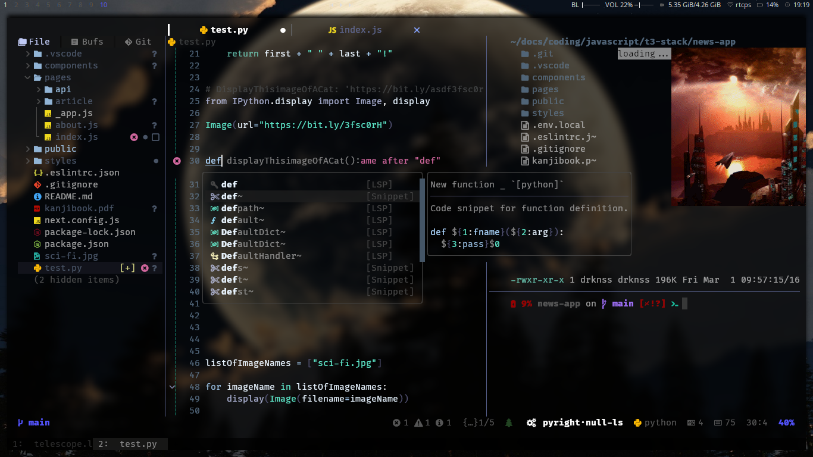

<div align="center">    
    <div align="left">
    <b> arch linux rice with: </b>
    <li> neovim IDE using only [mini.nvim](https://github.com/echasnovski/mini.nvim), [mason.nvim](https://github.com/williamboman/mason.nvim), [snacks.nvim](https://github.com/folke/snacks.nvim), [flash.nvim](https://github.com/folke/flash.nvim) and [supermaven-nvim](https://github.com/supermaven-inc/supermaven-nvim) </li>
    <li> preview/play/open images/videos/pdf/text inside terminal/GUI using <a href="https://github.com/sxyazi/yazi">yazi</a> </li>
    <li> touchcursor-like keyboard layout using <a href="https://github.com/jtroo/kanata">kanata</a> </li>
    <li> <a href="https://github.com/baskerville/bspwm">bspwm</a> window manager </li>
    </div>

---

**[<kbd> <br> Install <br> </kbd>][Install]** 
**[<kbd> <br> Keyboard-Layout <br> </kbd>][Keyboard-Layout]** 
**[<kbd> <br> Wiki <br> </kbd>][Wiki]** 
**[<kbd> <br> Dependencies <br> </kbd>][Dependencies]**

[Install]: #installation
[Keyboard-Layout]: #touchcursor-like-keyboard-layout
[Wiki]: https://github.com/YeferYV/archrice/wiki
[Dependencies]: https://github.com/YeferYV/archrice/wiki/dependencies

</div>

---

<details><summary>Table of Contents</summary>

1. Neovim TextObjects/Motions
   - [Neovim text object that starts with a/i](#neovim-text-object-that-starts-with-ai)
   - [Neovim text-object/motions that starts with g](#neovim-text-objectmotions-that-starts-with-g)
   - [Native neovim ctrl keys](#native-neovim-ctrl-keys)
2. Neovim keymaps
   - [Neovim Editor keymaps](#neovim-editor-keymaps)
   - [Neovim Suggestion keymaps](#neovim-suggestion-keymaps)
3. Terminal
   - [wezterm terminal keymaps](#wezterm-terminal-keymaps)
   - [zsh keymaps](#zsh-keymaps)
4. [BSPWM Window Manager](#bspwm-window-manager)
5. [Touchcursor-like Keyboard Layout](#touchcursor-like-keyboard-layout)
6. Installation
   - [Dependencies Installation](#installation)
   - [Treesitter Installation (optional)](#treesitter-installation-optional)
7. [Vim Cheatsheets](#vim-cheatsheets)
8. [Related projects](#related-projects)

</details>

---

## Neovim text object that starts with `a`/`i`

<details><summary></summary>

|         text-object keymap         | repeat action key | finds and autojumps? | text-object name | description                                                                               | inner / outer                                                                 |
| :--------------------------------: | :---------------: | :------------------: | :--------------- | :---------------------------------------------------------------------------------------- | :---------------------------------------------------------------------------- |
|             `ia`, `aa`             |        `.`        |         yes          | \_argument       | whole argument/parameter of a function                                                    | outer includes comma                                                          |
|             `ib`, `ab`             |        `.`        |         yes          | \_braces         | find the nearest inside of `()` `[]` `{}`                                                 | outer includes braces                                                         |
|             `iB`, `aB`             |        `.`        |         yes          | \_brackets       | find the nearest inside of `{}` `:help iB`                                                | outer includes brackets                                                       |
|             `ie`, `ae`             |        `.`        |                      | line             | from start to end of line without beginning whitespaces (line wise)                       | outer includes begining whitespaces                                           |
|             `if`, `af`             |        `.`        |         yes          | \_function_call  | like `function args` but only when a function is called                                   | outer includes the function called                                            |
|             `ih`, `ah`             |        `.`        |         yes          | \_html_attribute | attribute in html/xml like `href="foobar.com"`                                            | inner is only the value inside the quotes trailing comma and space            |
|             `ii`, `ai`             |        `.`        |                      | indent_noblanks  | surrounding lines with same or higher indentation delimited by blanklines                 | outer includes line above                                                     |
|             `iI`, `aI`             |        `.`        |                      | indent           | surrounding lines with same or higher indentation                                         | outer includes line above and below                                           |
|             `ik`, `ak`             |        `.`        |         yes          | \_key            | key of key-value pair, or left side of a assignment                                       | outer includes spaces                                                         |
|             `il`, `al`             |        `.`        |         yes          | +last            | go to last mini.ai text-object (which start with `_`)                                     | requires `i`/`a` example `vilk`                                               |
|             `im`, `am`             |        `.`        |         yes          | \_number         | numbers, similar to `<C-a>`                                                               | inner: only pure digits, outer: number including minus sign and decimal point |
|             `in`, `an`             |        `.`        |         yes          | +next            | go to Next mini.ai text-object (which start with `_`)                                     | requires `i`/`a` example `viNk`                                               |
|             `io`, `ao`             |        `.`        |         yes          | \_whitespaces    | whitespace beetween characters                                                            | outer includes surroundings                                                   |
|             `ip`, `ap`             |        `.`        |                      | paragraph        | blanklines can also be treat as paragraphs when focused on a blankline                    | outer includes below lines                                                    |
|             `iq`, `aq`             |        `.`        |         yes          | \_quotes         | inside of `` ` ` `` or `' '` or `" "`                                                     | outer includes openning and closing quotes                                    |
|             `is`, `as`             |        `.`        |                      | sentence         | sentence delimited by dots of blanklines `:help sentence`                                 | outer includes spaces                                                         |
|             `it`, `at`             |        `.`        |         yes          | \_tag            | inside of a html/jsx tag                                                                  | outer includes openning and closing tags                                      |
|             `iu`, `au`             |        `.`        |                      | \_subword        | like `iw`, but treating `-`, `_`, and `.` as word delimiters _and_ only part of camelCase | outer includes trailing `_`,`-`, or space                                     |
|             `iv`, `av`             |        `.`        |         yes          | \_value          | value of key-value pair, or right side of a assignment                                    | outer includes trailing commas or semicolons or spaces                        |
|             `iw`, `aw`             |        `.`        |                      | word             | from cursor to end of word (delimited by punctuation or space)                            | outer includes whitespace ending                                              |
|             `iW`, `aW`             |        `.`        |                      | WORD             | from cursor to end of WORD (includes punctuation)                                         | outer includes whitespace ending                                              |
|             `ix`, `ax`             |        `.`        |         yes          | \_Hex            | hexadecimal number or color                                                               | outer includes hash `#`                                                       |
|             `iy`, `ay`             |        `.`        |                      | same_indent      | surrounding lines with only same indent (delimited by blankspaces or commented lines)     | outer includes blankspaces                                                    |
|             `i?`, `a?`             |        `.`        |         yes          | \_user_prompt    | will ask you for enter the delimiters of a text object (useful for dot repeteability)     | outer includes surroundings                                                   |
|       `i(`, `i)`, `a(`, `a)`       |        `.`        |         yes          | `(` or `)`       | inside `()`                                                                               | outer includes surroundings                                                   |
|       `i[`, `i]`, `a[`, `a]`       |        `.`        |         yes          | `[` or `]`       | inside `[]`                                                                               | outer includes surroundings                                                   |
|       `i{`, `i}`, `a{`, `a}`       |        `.`        |         yes          | `{` or `}`       | inside `{}`                                                                               | outer includes surroundings                                                   |
|       `i<`, `i>`, `a<`, `a>`       |        `.`        |         yes          | `<` or `>`       | inside `<>`                                                                               | outer includes surroundings                                                   |
|         `` i` ``, `` a` ``         |        `.`        |         yes          | apostrophe       | inside `` ` ` ``                                                                          | outer includes surroundings                                                   |
| `i<punctuation>`, `a<punctuation>` |        `.`        |         yes          | `<punctuation>`  | inside `<punctuation><punctuation>`                                                       | outer includes surroundings                                                   |

</details>

## Neovim text-object/motions that starts with `g`

<details><summary></summary>

| text-object keymap |    mode     | repeat action key |    repeat jump key     | text-object description                                                   | normal mode                              | operating-pending mode | visual mode                  | examples in normal mode                                                      |
| :----------------: | :---------: | :---------------: | :--------------------: | :------------------------------------------------------------------------ | :--------------------------------------- | :--------------------- | :--------------------------- | :--------------------------------------------------------------------------- |
|     `g<`/`g>`      | `n`,`o`,`x` |        `.`        |                        | prev/next find                                                            | text-object not required                 | finds and jumps        | uses selection               | `cg>???` replaces last search with `???` forwardly                           |
|     `g;`/`g,`      |     `n`     |                   |                        | go backward/forward in `:changes`                                         | jumps                                    |                        |                              | `g;` go to last change                                                       |
|        `g.`        | `n`,`o`,`x` |                   |                        | jump to last change                                                       | jumps                                    | won't jump             | uses selection               | `vg.` selects from cursor position until last change                         |
|        `ga`        |   `n`,`x`   |                   |                        | +align                                                                    | followed by textobject/motion            |                        | uses selected region         | `gaip=` or `vipga=` aligns a paragraph by `=`                                |
|        `gb`        |   `n`,`x`   |        `.`        |                        | +blackhole register                                                       | followed by textobject/motion            |                        | deletes selection            | `gbip` or `vipgb` deletes a paragraph without copying                        |
|        `gB`        |   `n`,`x`   |        `.`        |                        | blackhole linewise                                                        | text-object not required                 |                        | deletes line                 | `gB.` deletes two lines without saving it in the register                    |
|        `gc`        | `n`,`o`,`x` |        `.`        |                        | +comment (`vgc` in normal mode will select a block comment)               | followed by textobject/motion            | won't jump             | uses selection               | `gcip` or `vipgc` comments a paragraph                                       |
|        `gC`        | `n`,`o`,`x` |        `.`        |                        | block comment (supports selection `vgC` or just `gC`)                     | select text-object under cursor          | won't jump             | reselects                    | `vgC` selects current block of comment                                       |
|        `gd`        |     `n`     |                   |                        | go to definition                                                          | jumps                                    |                        |                              | `gd` go to definition of word under cursor                                   |
|        `gD`        |     `x`     |                   |                        | git diff/hunk (vscode selects from cursor position to end of diff)        |                                          | won't jump             | reselects                    | `vgh` selects modified code                                                  |
|     `ge`/`gE`      | `n`,`o`,`x` |                   |                        | previous end of word/WORD (`WORD` omits punctuation)                      | jumps                                    | uses cursor position   | uses selection               | `vge` selects from cursor position until previous end of word                |
|        `gf`        |   `n`,`x`   |                   |                        | go to file under cursor                                                   | jumps                                    |                        | uses selection               | `gf` open in a tab the path under cursor                                     |
|      `gg`/`G`      | `n`,`o`,`x` |        `.`        |                        | first/last line                                                           | jumps                                    | uses cursor position   | uses selection               | `vgg` selects until first line                                               |
|        `gi`        |   `n`,`x`   |                   |                        | last position of cursor in insert mode                                    | finds and jumps                          |                        | uses selection               | `vgi` selects until last insertion                                           |
|     `gj`/`gk`      | `n`,`o`,`x` |        `.`        |                        | go down/up when wrapped                                                   | jumps                                    | uses cursor position   | uses selection               | `vgj` selects one line down                                                  |
|        `gJ`        |   `n`,`x`   |        `.`        |                        | join below lines                                                          | joins                                    |                        | uses selection               | `vgJ` joins selected lines into one line                                     |
|        `gm`        |   `n`,`x`   |                   |                        | +multiply (duplicate text) operator                                       |                                          | won't jump             | uses selection               | `gnap` or `vapgm` duplicates paragraph without replacing clipboard           |
|        `gM`        |   `n`,`x`   |                   |                        | go to middle line                                                         | jumps                                    |                        | uses selection               | `vgM` selects until middle of the line                                       |
|     `gp`/`gn`      | `n`,`o`,`x` |        `.`        | `;`forward `,`backward | +prev/+next textobj (only textobj with `_` prefix)                        | finds and jumps                          | followed by textobject | uses selection               | `vgniq` selects from cursor position until next quotation                    |
|   `gpc` / `gnc`    | `n`,`o`,`x` |        `.`        | `;`forward `,`backward | previous/next comment                                                     | finds and jumps                          | jumps                  | uses selection               | `vgnc` selects from cursor position until next comment                       |
|   `gpd` / `gnd`    | `n`,`o`,`x` |        `.`        | `;`forward `,`backward | previous/next diagnostic                                                  | finds and jumps                          | jumps                  | uses selection               | `vgnd` selects from cursor position until next diagnostic                    |
|   `gpf` / `gnf`    | `n`,`o`,`x` |        `.`        | `;`forward `,`backward | previous/next fold (only inside neovim)                                   | finds and jumps                          | jumps                  | uses selection               | `vgnf` selects from cursor position until next fold                          |
|   `gpH` / `gnH`    | `n`,`o`,`x` |        `.`        | `;`forward `,`backward | previous/next git hunk                                                    | finds and jumps                          | jumps                  | uses selection               | `vgnH` selects from cursor position until next git hunk                      |
|   `gpr` / `gnr`    | `n`,`o`,`x` |        `.`        | `;`forward `,`backward | previous/next reference (only inside vscode)                              | finds and jumps                          | jumps                  | uses selection               | `vgnr` selects from cursor position until next reference                     |
|        `gq`        |   `n`,`x`   |        `.`        |                        | +format selection/comments 80chars (LSP overrides it)                     | requires a textobject                    |                        | applies to selection         | `gqip` or `vipgq` formats a paragraph                                        |
|        `gr`        |   `n`,`x`   |        `.`        |                        | +replace (with register) operator                                         | followed by text-object/motion           |                        | applies to selection         | `griw` or `viwgr` replaces word with register (yanked text)                  |
|        `gs`        |   `n`,`x`   |        `.`        |                        | +sort Operator                                                            | followed by text-object/motion           |                        | uses selection               | `gsip` or `vipgs` sorts a paragraph                                          |
|        `gS`        |   `n`,`x`   |        `.`        |                        | split/join arguments                                                      | toggles inside `{}`,`[]`,`()`            |                        | followed by operator         | `vipgS` joins selected lines in one line                                     |
|     `gt`/`gT`      |   `n`,`x`   |        `.`        | `;`ending `,`beginning | +go to end/start of textobj                                               | followed by text-object                  |                        | selects form cursor position | `vgtiq` selects until end of quotation                                       |
|     `gu`/`gU`      |   `n`,`x`   |        `.`        |                        | +to lowercase/uppercase                                                   | requires a text-object                   |                        | applies to selection         | `guip` or `vipgu` lowercases a paragraph                                     |
|        `gv`        |   `n`,`x`   |                   |                        | last selected                                                             | finds and jumps                          |                        | reselects                    | `vgv` selects last selection                                                 |
|        `gw`        |   `n`,`x`   |        `.`        |                        | split/join comments/lines 80chars (keeps cursor position)                 | requires a text-object                   |                        | applies to selection         | `gwip` or `vipgw` split/join a paragraph limited by 80 characters            |
|        `gx`        |   `n`,`x`   |        `.`        |                        | +exchange (text) Operator                                                 | followed by text-object/motion           |                        | uses selection               | `gxiw` or `viwgx` exchanges word with another `gxiw` or `viwgx` or `.`       |
|     `gy`/`gY`      |     `n`     |        `.`        |                        | redo register (dot to paste forward/bacward)                              | paste                                    |                        |                              | `gy.....` paste deleted lines by history                                     |
|     `g-`/`g+`      |   `n`,`x`   |        `.`        |                        | decrement/increment number                                                | selects number under cursor              |                        | uses selected number         | `g+..` or `3g+` increments by 3                                              |
| `g<Up>`/`g<Down>`  |   `n`,`x`   |                   |                        | numbers ascending/descending                                              | selects number under cursor              |                        | uses selected number         | `g<Up>` increases selected numbers ascendingly                               |
|        `=`         |   `n`,`x`   |        `.`        |                        | +autoindent                                                               | followed by text-object                  |                        | uses selection               | `==` autoindents line                                                        |
|      `<`/`>`       |   `n`,`x`   |        `.`        |                        | +indent left/right                                                        | followed by text-object                  |                        | uses selection               | `<<` indents to left a line                                                  |
|      `0`/`$`       | `n`,`o`,`x` |        `.`        |                        | start/end of line                                                         | jumps                                    |                        | uses selection               | `d$j.` deletes two end-of-lines                                              |
|        `^`         | `n`,`o`,`x` |        `.`        |                        | start of line (non-blankline)                                             | jumps                                    |                        | uses selection               | `d^` deletes until start of line (after whitespace)                          |
|        `%`         | `n`,`o`,`x` |                   |                        | matching character: '()', '{}', '[]'                                      | finds and jumps                          |                        | finds and jumps              | `d%` deletes until bracket                                                   |
|      `(`/`)`       | `n`,`o`,`x` |        `.`        |                        | prev/next sentence                                                        | jumps                                    |                        | uses selection               | `d(.` deletes until start of sentence (two times)                            |
|      `{`/`}`       | `n`,`o`,`x` |        `.`        |                        | prev/next empty line (before a paragraph)                                 | jumps                                    |                        | uses selection               | `d{.` deletes until next empty line (two times)                              |
|     `[[`/`]]`      | `n`,`o`,`x` |        `.`        |                        | prev/next section                                                         | jumps                                    |                        | uses selection               | `d[[` deletes until start of section                                         |
|      `b`/`w`       | `n`,`o`,`x` |        `.`        |                        | prev/next word                                                            | jumps                                    |                        | uses selection               | `db` deletes until start of word                                             |
|      `B`/`W`       | `n`,`o`,`x` |        `.`        |                        | prev/next WORD                                                            | jumps                                    |                        | uses selection               | `dW.` deletes 2 WORDS                                                        |
|      `e`/`E`       | `n`,`o`,`x` |        `.`        |                        | end of word/WORD                                                          | jumps                                    |                        | uses selection               | `de` deletes until end of word                                               |
|        `f`         | `n`,`o`,`x` |        `.`        |                        | search with labels like [flash.nvim](https://github.com/folke/flash.nvim) | jumps                                    |                        | uses selection               | `f???` then press the label                                                  |
|      `f`/`F`       | `n`,`o`,`x` |        `.`        | `;`forward `,`backward | move to next/prev char (`f` to repeat_jump on vscode-neovim)              | jumps                                    |                        | uses selection               | `df,` deletes until a next `,`                                               |
|      `t`/`T`       | `n`,`o`,`x` |        `.`        | `;`forward `,`backward | move before next/prev char (`f` to repeat_jump on vscode-neovim)          | jumps                                    |                        | uses selection               | `dt,` deletes before next `,`                                                |
|        `s`         |     `o`     |        `.`        |                        | surround (only on vscodevim)                                              |                                          | uses cursor position   |                              | `ysiw"` or `viwS"` adds `"` to word, `ds"` deletes `"`, `cs"'` replaces `"`  |
|        `s`         |   `n`,`x`   |        `.`        |                        | +surround (followed by a=add, d=delete, r=replace)                        | followed by textobject/motion (only add) |                        | uses selection (only add)    | `saiw"` or `viwsa"` adds `"` to word, `sd"` deletes `"`, `sr"'` replaces `"` |
|        `U`         |   `n`,`x`   |                   |          `U`           | whichkey.repeatMostRecent (inside neovim repeats `:<command>`)            |                                          |                        |                              | `<s-space>gjUUUUU` repeats go to next git-change                             |
|        `Y`         |   `n`,`x`   |                   |                        | yank until end of line                                                    |                                          |                        | uses selection               | `v^Y` yanks line                                                             |
| `<space><space>p`  |   `n`,`x`   |        `.`        |                        | Paste after (secondary clipboard)                                         |                                          |                        | uses selection               | `viw<space><space>p` replaces word with a second clipboard                   |
| `<space><space>P`  |   `n`,`x`   |        `.`        |                        | Paste before (secondary clipboard)                                        |                                          |                        | uses selection               | `viw<space><space>P` replaces word with a second clipboard                   |
| `<space><space>y`  |   `n`,`x`   |                   |                        | yank (secondary clipboard)                                                |                                          |                        | uses selection               | `viw<space><space>y` yanks word using the second clipboard                   |
| `<space><space>Y`  |   `n`,`x`   |                   |                        | yank until end of line (secondary clipboard)                              |                                          |                        | uses selection               | `v<space><space>Y` yanks until end of line using the second clipboard        |
| `<space><space>j`  | `n`,`x`,`o` |                   | `;`forward `,`backward | prev ColumnMove                                                           | jumps                                    |                        | uses selection               | `v<space><space>j` selects until start of column                             |
| `<space><space>k`  | `n`,`x`,`o` |                   | `;`forward `,`backward | next ColumnMove                                                           | jumps                                    |                        | uses selection               | `v<space><space>k` selects until end of coumn                                |

</details>

## Native neovim ctrl keys

<details open><summary></summary>

| Key Combination |  mode   | Description                                                                                                                                        |
| :-------------: | :-----: | :------------------------------------------------------------------------------------------------------------------------------------------------- |
|    `ctrl+a`     | `n`,`v` | increase number under cursor                                                                                                                       |
|    `ctrl+c`     |   `v`   | stops selection                                                                                                                                    |
|    `ctrl+d`     | `n`,`v` | scroll down by half page                                                                                                                           |
|    `ctrl+e`     | `n`,`v` | scroll down by line                                                                                                                                |
|    `ctrl+i`     |   `n`   | jump to next in `:jumps`                                                                                                                           |
|    `ctrl+o`     |   `n`   | jump to previous in `:jumps`                                                                                                                       |
|    `ctrl+r`     |   `n`   | redo (`u` to undo)                                                                                                                                 |
|    `ctrl+s`     | `n`,`v` | replace text (using `sed` syntax)(only replaces selected region on visual mode)(neovim only)                                                       |
|    `ctrl+u`     | `n`,`v` | scroll up by half page                                                                                                                             |
|    `ctrl+v`     | `n`,`v` | visual block mode                                                                                                                                  |
|    `ctrl+w`     | `n`,`v` | See [vscode-window-commands.vim](https://github.com/vscode-neovim/vscode-neovim/blob/v1.18.17/runtime/vscode/overrides/vscode-window-commands.vim) |
|    `ctrl+x`     | `n`,`v` | decrease number under cursor                                                                                                                       |
|    `ctrl+y`     | `n`,`v` | scroll up by line                                                                                                                                  |
|    `ctrl+/`     | `n`,`v` | comment line (only inside vscode)                                                                                                                  |

</details>

## Neovim Editor keymaps

<details><summary></summary>

|     Key Combination      |  mode   | Description                                               |
| :----------------------: | :-----: | :-------------------------------------------------------- |
|         `ctrl+\`         |   `n`   | Toggle (terminal) visibility                              |
|         `<esc>`          |   `n`   | clear search highlight                                    |
|       `<esc><esc>`       |   `t`   | terminal normal-mode (when inside neovim's terminal)      |
|           `i`            |   `t`   | terminal exit normal-mode (when inside neovim's terminal) |
|        `<space>`         |   `n`   | Show whichkey menu                                        |
|       `<space>e?`        |   `n`   | open file explorer (Snacks.explorer) and show keybindings |
|           `jk`           |   `i`   | send Escape                                               |
|         `alt+h`          | `i`,`x` | Send Escape                                               |
|   `alt+h` or `shift+h`   |   `n`   | Type `10h`                                                |
|   `alt+j` or `shift+j`   |   `n`   | Type `10gj`                                               |
|   `alt+k` or `shift+k`   |   `n`   | Type `10gk`                                               |
|   `alt+k` or `shift+l`   |   `n`   | Type `10l`                                                |
|          `left`          |   `n`   | Go to previous editor                                     |
|         `right`          |   `n`   | Go to next editor                                         |
| `alt+left` or `alt+down` |   `n`   | Decrease view size                                        |
| `alt+right` or `alt+up`  |   `n`   | Increase view size                                        |
|         `ctrl+h`         |   `n`   | Navigate to left window                                   |
|         `ctrl+j`         |   `n`   | Navigate to down window                                   |
|         `ctrl+k`         |   `n`   | Navigate to up window                                     |
|         `ctrl+l`         |   `n`   | Navigate to right window                                  |
|        `shift+q`         |   `n`   | Close active editor                                       |
|        `shift+r`         |   `n`   | Format and save                                           |

</details>

## Neovim Suggestion keymaps

<details><summary></summary>

| Key Combination | mode | Description                              |
| :-------------: | :--: | :--------------------------------------- |
|  `ctrl+space`   | `i`  | open suggestion menu                     |
|     `alt+j`     | `i`  | inline suggestion accept next word       |
|     `alt+k`     | `i`  | inline suggestion accept next line       |
|     `alt+l`     | `i`  | Commit inline suggestion                 |
|   `downarrow`   | `i`  | go to next suggestion (enter to accept)  |
|    `uparrow`    | `i`  | go to prev suggestion (enter to accept)  |
|      `tab`      | `i`  | go to next suggestion (enter not needed) |
|   `shift+tab`   | `i`  | go to prev suggestion (enter not needed) |
|     `alt+;`     | `i`  | go to next snippet stop                  |
|     `alt+,`     | `i`  | go to prev snippet stop                  |
|     `alt+.`     | `i`  | expand snippet                           |
|    `ctrl+c`     | `i`  | exit snippet session                     |

</details>

---

## Wezterm Terminal keymaps

<details><summary></summary>

|         Key Combination          | Description                                  |
| :------------------------------: | :------------------------------------------- |
|       `<show all keymaps>`       | run `wezterm --show-keys`                    |
| `shift+space` or `ctrl+shift+x`  | enter vim mode (`/` to search,`v` to select) |
|          `alt+shift+f`           | enter search mode (`n`,`p` like vim mode)    |
|    `alt+c` or `ctrl+shift+c`     | copy selection in terminal                   |
|    `alt+v` or `ctrl+shift+v`     | paste in terminal                            |
|             `alt+e`              | scroll terminal up by line                   |
|             `alt+d`              | scroll terminal down by line                 |
|             `alt+q`              | scroll terminal up by page                   |
|             `alt+a`              | scroll terminal down by page                 |
|             `alt+t`              | scroll terminal to top                       |
|             `alt+g`              | scroll terminal to bottom                    |
|   `alt+s` or `ctrl+shift+tab`    | go to previous tab                           |
|      `alt+f` or `ctrl+tab`       | go to next tab                               |
|         `alt+ctrl+left`          | resize terminal pane left                    |
|         `alt+ctrl+right`         | resize terminal pane right                   |
|         `alt+ctrl+down`          | resize terminal pane down                    |
|          `alt+ctrl+up`           | resize terminal pane up                      |
|        `alt+ctrl+shift+r`        | rotate panes (clockwise)                     |
|           `alt+ctrl+r`           | rotate panes (counter clockwise)             |
|          `alt+shift+s`           | move to previous tab                         |
|          `alt+shift+f`           | move to next tab                             |
|          `alt + <1..9>`          | go to tab <1..9>                             |
|     `ctrl + shift + <1..8>`      | go to tab <1..8>                             |
|            `alt + 0`             | go to last tab                               |
|        `ctrl + shift + 9`        | go to last tab                               |
|             `alt+;`              | go to recent tab                             |
|             `ctrl+0`             | reset font size                              |
|             `ctrl+=`             | increase font size                           |
|             `ctrl+-`             | decrease font size                           |
|            `ctr+left`            | go to left pane                              |
|           `ctrl+down`            | go to down pane                              |
|            `ctrl+up`             | go to up pane                                |
|           `ctr+right`            | go to right pane                             |
|         `ctrl+a ctrl+a`          | Send `ctrl+a`                                |
|            `ctrl+a [`            | open_in_vim                                  |
|            `ctrl+a ]`            | move_pane_to_new_tab                         |
|            `ctrl+a !`            | `wezterm cli move-pane-to-new-tab`           |
|        `ctrl+shift+space`        | quick select                                 |
|         `ctrl+alt+space`         | quick select and open in browser             |
|    `ctrl+a v` or `alt+ctrl+h`    | split vertical                               |
| `ctrl+a shift+v` or `alt+ctrl+v` | split horizontal                             |
|          `ctrl+shift+f`          | search (case insensitive)                    |
|          `ctrl+shift+k`          | clear scrollback                             |
|          `ctrl+shift+n`          | new window                                   |
|          `ctrl+shift+p`          | command palette                              |
|          `ctrl+shift+u`          | select unicode                               |
|    `ctrl+t` or `ctrl+shift+t`    | new tab (with current working directory)     |
|    `ctrl+w` or `ctrl+shift+w`    | close current tab                            |
|          `ctrl+shift+z`          | toggle pane zoom state                       |

</details>

---

## zsh keymaps

<details><summary></summary>

|       keymap       | description                                                |
| :----------------: | :--------------------------------------------------------- |
|      `<tab>`       | show (dash/path) options or complete path                  |
|    `<tab><tab>`    | enter completion menu                                      |
|    `<esc><esc>`    | tmux-copy-mode-like / normal-mode (inside neovim terminal) |
|    `vi<enter>`     | open retronvim's neovim IDE (`<space>` to open whichkey)   |
|     `y<enter>`     | open yazi (changes directory on exit)                      |
|      `alt+o`       | open yazi (even while writing commands)                    |
| `alt+h` or `<esc>` | enter vim-mode                                             |
|      `alt+j`       | previous history and enter vim-mode                        |
|      `alt+k`       | next history and enter vim-mode                            |
|      `alt+l`       | complete suggestion and enter vim-mode                     |
|      `ctrl+r`      | search history with fzf                                    |
|      `ctrl+l`      | clear screen                                               |
|    `ctrl+alt+l`    | clear screen (inside neovim terminal)                      |

</details>

---

## BSPWM Window Manager

<details><summary></summary>

| Keymap                                         | Description                                                |
| ---------------------------------------------- | ---------------------------------------------------------- |
| `super + Return`                               | Open wezterm                                               |
| `super + {_, shift} + Escape`                  | Dunst close/reopen notification                            |
| `super + Escape`                               | Stop cronbat                                               |
| `super + shift + Escape`                       | Reload sxhkd configuration                                 |
| `super + {_, shift} + x`                       | Close/kill window                                          |
| `super + control + f; m`                       | Alternate between tiled and monocle layout                 |
| `super + control + f; {q,r}`                   | Quit/restart bspwm                                         |
| `super + control + f; {t,p,f,shift + f}`       | Set window state {tiled,pseudo-tiled,floating,fullscreen}  |
| `super + control + f; {shift + m,l,s,p,h}`     | Set node flags {marked,locked,sticky,private,hidden}       |
| `super + control + f; {plus}`                  | Show hidden nodes one by one                               |
| `alt + Tab`                                    | Rofi alt-tab                                               |
| `super + control + r; d`                       | Rofi drun (dmenu for .desktop apps)                        |
| `super + control + r; {e, shift + e}`          | Rofi emoji                                                 |
| `super + {_,shift} + {1-9,0,minus,equal}`      | Focus or send to the given desktop                         |
| `super + {semicolon,grave}`                    | Focus the last node/desktop                                |
| `super + shift + {semicolon,grave}`            | Swap the last node/desktop                                 |
| `super + {_,shift} + c`                        | Focus the next/previous window in the current desktop      |
| `super + {h,j,k,l}`                            | Focus node in given direction                              |
| `super + shift + {h,j,k,l}`                    | Swap focused window in given direction                     |
| `super + {s,f}`                                | Focus the next/previous desktop in the current monitor     |
| `super + shift + {s,f}`                        | Swap the next/previous desktop in the current monitor      |
| `super + control + s; shift + b`               | Swap current node and biggest window                       |
| `super + control + s; {p,b,f,s}`               | focus the {parent,brother,first,second} node               |
| `super + control + s; {minus,plus}`            | Increase/decrease gap size by 1                            |
| `super + control + s; {o,n}`                   | Focus the older or newer node in the focus history         |
| `super + control + s; {r, shift + r}`          | Rotate focused tree CCW/CW                                 |
| `super + control + s; {Right, Left}`           | Rotate the current nodes parent                            |
| `super + control + s; {Down, Up}`              | Rotate the current node focused                            |
| `super + control + t; space`                   | Toggle polybar                                             |
| `super + control + t; n`                       | Toggle node border (width 1)                               |
| `super + control + t; shift + n`               | Toggle node border (width 2)                               |
| `super + control + t; d`                       | Toggle desktop border (width 1)                            |
| `super + control + t; shift + d`               | Toggle desktop border (width 2)                            |
| `super + control + t; s`                       | Toggle singleton border                                    |
| `super + control + t; g`                       | Toggle gaps (no border)                                    |
| `super + control + t; 1`                       | Toggle gaps (border_width 1)                               |
| `super + control + t; 2`                       | Toggle gaps (border_width 2)                               |
| `super + control + w; b`                       | Balance desktop's nodes                                    |
| `super + control + w; {minus,plus}`            | Increase/decrease window size                              |
| `super + control + w; {h,j,k,l}`               | Hover window to left/down/up/right                         |
| `super + control + {Left, Down, Up, Right}`    | Move floating window by 10px                               |
| `super + control + w; {Left, Down, Up, Right}` | Hover window to corner                                     |
| `super + control + w; {s,m}`                   | Xdo resize (small/medium)                                  |
| `super + control + w; {f, shift + f}`          | Xdo fixedscreen 1366x768 (fullscreen no visible borders)   |
| `super + control + w; {m, shift + m}`          | Xdo fixedscreen 1366x768 (min-max window)                  |
| `super + {Left,Down,Up,Right}`                 | Smart resize (Will always grow for floating nodes)         |
| `super + shift + {Left,Down,Up,Right}`         | Smart resize (Will always shrink for floating nodes)       |
| `super + XF86Audio{Raise,Lower}Volume`         | Increase/Decrease volume by 5%                             |
| `XF86Audio{Raise,Lower}Volume`                 | Increase/Decrease volume by 2%                             |
| `XF86AudioMute`                                | (Un)mute audio                                             |
| `XF86AudioMicMute`                             | (Un)mute microphone                                        |
| `XF86MonBrightness{Down,Up}`                   | Increase/Decrease backlight by 0.1                         |
| `super + XF86MonBrightness{Down,Up}`           | Increase/Decrease backlight by 2                           |
| `shift + XF86MonBrightness{Down,Up}`           | Dimmer (requires xcalib)                                   |
| `super + {F11,F12}`                            | Dmenu (u)mount android (requires simple-mtpfs)             |
| `super + KP_{Right,Begin,Left}`                | Chromium {next,play-pause,previous}                        |
| `alt + KP_{Right,Begin,Left}`                  | Mpv {next,play-pause,previous}                             |
| `alt + KP_{Down,Up}`                           | Mpv volume {Down, Up}                                      |
| `KP_{Right,Begin,Left,Down,Up}`                | Mpc {next,toggle,prev,volume -2,volume +2}                 |
| `{Print, super + Print}`                       | Screenshot {fullscreen, menu}                              |
| `super + control + c; w`                       | Compositor wallpaper background                            |
| `super + control + c; b`                       | Compositor blur background                                 |
| `super + control + c; k`                       | Compositor keep background                                 |
| `super + control + c; s`                       | Compositor no shadow                                       |
| `super + control + {minus,plus}`               | Compositor decrease/increase transparency                  |
| `super + control + r; {1,2,3,4,5}`             | Nighlight temperature                                      |
| `super + control + p; t`                       | Toggle terminal background between #0c0c0c #000000         |
| `super + control + p; o`                       | Set a offline wallpaper (requires pywal)                   |
| `super + control + p; {w,r}`                   | Set a online {wallhaven,reddit} wallpaper (requires pywal) |
| `super + {_,shift} + p`                        | Dmenu {launcher, launch inside wezterm}                    |
| `super + {_,shift} + w`                        | Open/close google-chrome                                   |

</details>

---

## Touchcursor-like Keyboard Layout

<details><summary></summary>

**layer qwerty**

```
@grl 1    2    3    4    5    6    7    8    9    0    -    =    bspc
tab  q    w    e    r    t    y    u    i    o    p    [    ]    \
@cap a    s    d    f    g    h    j    k    l    ;    '    ret
lsft z    x    c    v    b    n    m    ,    .    /    rsft
lctl lmet @alt           @spc           @sft rmet rctl
```

**layer touchcursor** (press and hold space to enter the layer)

```
_    f1   f2   f3   f4   f5   f6   f7   f8   f9   f10  f11  f12  _
_    @¿   _    _    _    @m🡠  @M↓  @m↓  @m↑  @M↑  @m🡪  _    _    _
_    del  spc  bspc @clr _    @🡠   @↓   @↑   @🡪   @yaz _    _
_    @ñ   _    caps _    _    pgup home end  pgdn _    _
_    _    _              _              _    _    _
```

| key  | description                                                                               |          example / keymap          |
| :--: | :---------------------------------------------------------------------------------------- | :--------------------------------: |
| @grl | tap: backtick/grave, hold and press `1` = qwerty layer, hold and press `2` = dvorak layer |         `` `+2 = dvorak ``         |
| @cap | tap for escape, hold for LeftCtrl                                                         |          `cap+l = ctrl+l`          |
| @sft | tap for backspace, hold for LeftShift                                                     |         `RAlt+l = shift+l`         |
| @alt | tap for middle click, hold for LeftAlt                                                    |         `LAlt+l = LAlt+l`          |
| @spc | tap for space, hold for touchcursor layer, release for qwerty layer                       | `space+jj = DownArrow + DownArrow` |
| @yaz | open yazi_cd on any shell                                                                 |             `space+;`              |
| @clr | clear screen on any shell                                                                 |             `space+f`              |
|  @¿  | unicode ¿                                                                                 |             `space+q`              |
|  @ñ  | unicode ñ                                                                                 |             `space+z`              |
| @m🡠  | mouse scrolling left                                                                      |             `space+t`              |
| @m🡪  | mouse scrolling right                                                                     |             `space+p`              |
| @m↑  | mouse scrolling up                                                                        |             `space+i`              |
| @m↓  | mouse scrolling down                                                                      |             `space+u`              |
| @M↑  | mouse fast scrolling up                                                                   |             `space+y`              |
| @M↓  | mouse fast scrolling down                                                                 |             `space+p`              |
| spc  | space key                                                                                 |             `space+s`              |
| bspc | backspace key                                                                             |             `space+d`              |
| home | home key                                                                                  |             `space+m`              |
| end  | end key                                                                                   |             `space+,`              |
| pgup | pageup key                                                                                |             `space+n`              |
| pgdn | pagedown key                                                                              |             `space+.`              |
|  @🡠  | left arrow key                                                                            |             `space+h`              |
|  @↓  | down arrow key                                                                            |             `space+j`              |
|  @↑  | up arrow key                                                                              |             `space+k`              |
|  @🡪  | right arrow key                                                                           |             `space+l`              |
| caps | toggles capslock                                                                          |             `space+c`              |

</details>

---

## Installation

<details open><summary></summary>

```bash
archintalll                                   # see https://www.youtube.com/watch?v=y9nKjTfDHLA
git clone --recursive https://github.com/yeferyv/archrice
cd archrice/.local/bin
./ResetArch                                   # to install all dependencies
sudo ARCH_USER=user ./RiceArch                # to configure arch linux (change ARCH_USER to your $USER if you don't want to create a new user, ARCH_USER and root password is "toor")
```

</details>

## Vim Cheatsheets

<details open><summary></summary>

- [devhints.io/vim](https://devhints.io/vim) most used vim keys
- [viemu.com](http://www.viemu.com/a_vi_vim_graphical_cheat_sheet_tutorial.html) vim keys from A-Z
- [vscode with embedded neovim](https://www.youtube.com/watch?v=g4dXZ0RQWdw) youtube tutorial most of the keybindings are similar to archrice's neovim
- [treesitter text-objects demo](https://www.youtube.com/watch?v=FuYQ7M73bC0) youtube tutorial the keybindings are similar to archrice's neovim
- [treesitter text-objects extended](https://www.youtube.com/watch?v=CEMPq_r8UYQ) youtube tutorial the keybindings are similar to archrice's neovim
- [text-objects from A-Z](https://www.youtube.com/watch?v=JnD9Uro_oqc) youtube tutorial the keybindings are similar to archrice's neovim
- [motion-operators from A-Z](https://www.youtube.com/watch?v=HhZJ1kbzkj0) youtube tutorial the keybindings are the same as to archrice's neovim

</details>

## Related projects

<details open><summary></summary>

- [yeferyv/retronvim](https://github.com/yeferyv/retronvim) (minimal archrice for vscode) vscode extension with neovim text objects from A-Z + LSP whichkey + touchcursor keyboard layout
- [yeferyv/sixelrice](https://github.com/yeferyv/sixelrice) (minimal archrice for terminal/text interface) neovim text object from A-Z, based on [lazyvim](https://github.com/LazyVim/LazyVim)
- [yeferyv/dotfiles](https://github.com/yeferyv/dotfiles) (minimal archrice + keybindings for managing windows in any desktop environment) my dotfiles with archlinux, debian and windows support/installer
- [LukeSmithxyz/voidrice](https://github.com/LukeSmithxyz/voidrice) arch linux rice with dwm + lf [see dependencies](https://github.com/LukeSmithxyz/LARBS/blob/master/static/progs.csv)

</details>
